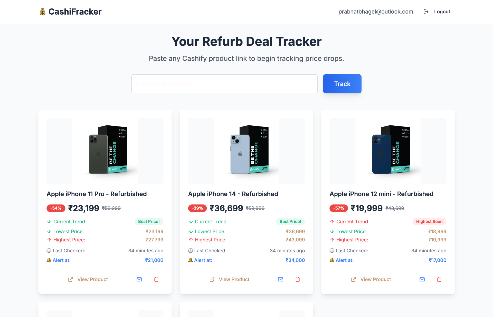
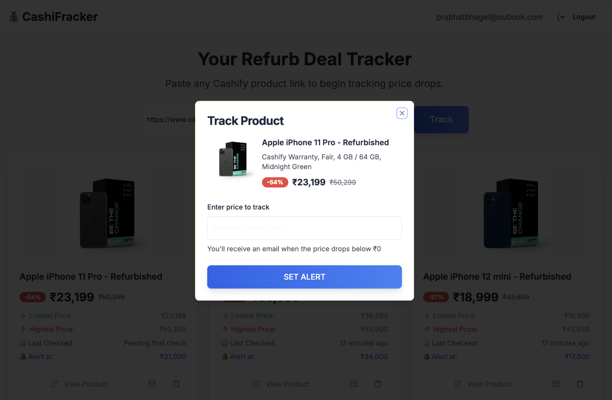
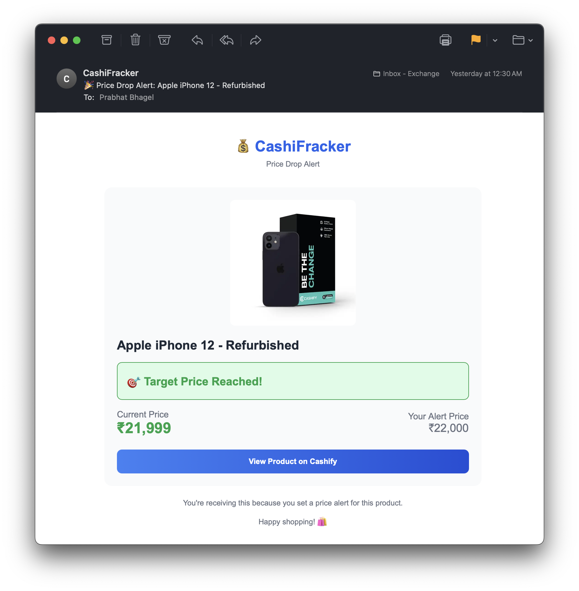

# 💰 CashiFracker - Cashify Product Price Tracker

A powerful web application that helps you track price drops on refurbished products from Cashify. Never miss a great deal again!

## 🎥 Demo Video

[](https://youtu.be/RRXKS3itN0Y)

Watch the full demo: [https://youtu.be/RRXKS3itN0Y](https://youtu.be/RRXKS3itN0Y)

## ✨ Features

### 🔍 Smart Product Tracking
- **Easy URL Input**: Simply paste any Cashify product link to start tracking
- **Real-time Price Monitoring**: Automated hourly price checks
- **Price History**: Track lowest and highest prices over time
- **Custom Price Alerts**: Set your desired price point and get notified

### 📧 Email Notifications
- **Instant Alerts**: Get notified immediately when prices drop below your target
- **Test Notifications**: Send test emails to verify your alert setup
- **Beautiful Email Templates**: Professional-looking price alert emails

### 🛡️ Secure & Personal
- **User Authentication**: Secure login with Supabase Auth
- **Private Tracking**: Your tracked products are completely private
- **Row Level Security**: Database-level security ensures data isolation

### 📱 Modern Interface
- **Responsive Design**: Works perfectly on desktop and mobile
- **Real-time Updates**: See changes instantly without page refreshes
- **Intuitive Dashboard**: Clean, organized view of all your tracked products

## 🖼️ Screenshots

### Dashboard Overview


*Main dashboard showing tracked products with price history, alerts, and last checked status*

### Product Tracking Dialog


*Easy product tracking setup with custom price alert configuration*

### Email Notification Example


*Professional email alert when your target price is reached*

## 🚀 Getting Started

### Prerequisites

- Node.js & npm ([install with nvm](https://github.com/nvm-sh/nvm#installing-and-updating))
- Supabase account for backend services

### Installation

1. **Clone the repository**
   ```bash
   git clone <YOUR_GIT_URL>
   cd <YOUR_PROJECT_NAME>
   ```

2. **Install dependencies**
   ```bash
   npm install
   ```

3. **Set up environment variables**
   Create a `.env.local` file with your Supabase credentials:
   ```env
   VITE_SUPABASE_URL=your_supabase_url
   VITE_SUPABASE_ANON_KEY=your_supabase_anon_key
   ```

4. **Start the development server**
   ```bash
   npm run dev
   ```

5. **Open your browser**
   Navigate to `http://localhost:5173`

## 🏗️ Tech Stack

### Frontend
- **React 18** - Modern React with hooks
- **TypeScript** - Type-safe development
- **Vite** - Lightning-fast build tool
- **Tailwind CSS** - Utility-first styling
- **shadcn/ui** - Beautiful, accessible components
- **React Router** - Client-side routing
- **React Query** - Data fetching and caching

### Backend & Services
- **Supabase** - Backend-as-a-Service
  - Authentication
  - PostgreSQL Database
  - Real-time subscriptions
  - Edge Functions
  - Cron Jobs
- **Edge Functions** - Serverless functions for:
  - Web scraping Cashify products
  - Price monitoring
  - Email notifications

### Key Libraries
- **Lucide React** - Beautiful icons
- **React Hook Form** - Form management
- **Zod** - Schema validation
- **Cheerio** - Server-side HTML parsing
- **Date-fns** - Date manipulation

## 🔧 How It Works

### 1. Product Tracking Setup
- User pastes a Cashify product URL
- System scrapes product details (name, price, image, etc.)
- User sets a custom price alert threshold
- Product is saved to user's private tracking list

### 2. Automated Price Monitoring
- Cron job runs every hour (`price-monitor-hourly`)
- Scrapes current prices for all tracked products
- Updates price history and statistics
- Triggers email alerts when prices drop below thresholds

### 3. Price History & Analytics
- **Current Price**: Latest scraped price
- **Lowest Price**: Historically lowest price seen
- **Highest Price**: Historically highest price seen
- **Discount**: Percentage off from original price
- **Last Checked**: Timestamp of last price check

### 4. Email Notifications
- Automatic alerts when target price is reached
- Manual test notifications to verify setup
- Professional email templates with product images
- Includes direct links to purchase

## 📊 Database Schema

### `tracked_products`
- User's tracked products with current pricing
- Price alert thresholds
- Product metadata (name, image, URL)

### `price_history`
- Historical price data for trend analysis
- Timestamps for price changes
- Linked to tracked products

### Row Level Security (RLS)
- Users can only access their own data
- System functions can update all records
- Complete data isolation between users

## 🔐 Security Features

- **Authentication**: Secure user login/logout
- **Row Level Security**: Database-level access control
- **Data Isolation**: Each user's data is completely private
- **Secure APIs**: All API calls are authenticated
- **Input Validation**: Zod schemas validate all inputs

## 🚀 Deployment

### Quick Deploy with Lovable
1. Open your [Lovable Project](https://lovable.dev/projects/d816e44f-0de9-4796-bf6f-9046b67da51f)
2. Click **Share** → **Publish**
3. Your app will be live at `yourapp.lovable.app`

### Custom Domain
1. Navigate to **Project** → **Settings** → **Domains**
2. Click **Connect Domain**
3. Follow the setup instructions

*Note: Custom domains require a paid Lovable plan*

## 🔮 Future Improvements

### 🎯 Short-term Enhancements (0-3 months)
- [ ] **Enhanced Input Validation**: Comprehensive URL validation and sanitization
- [ ] **Rate Limiting**: Implement API rate limiting to prevent abuse
- [ ] **Error Boundaries**: Better error handling with user-friendly messages  
- [ ] **Loading States**: Improved loading indicators and skeleton screens
- [ ] **Mobile Optimization**: Enhanced mobile responsiveness and PWA features
- [ ] **Email Templates**: More customizable and branded email designs
- [ ] **Price Trend Visualization**: Interactive charts showing price history

### 📈 Medium-term Features (3-6 months)
- [ ] **Multi-platform Support**: Track products from Amazon, Flipkart, and other retailers
- [ ] **Advanced Filtering**: Filter tracked products by category, price range, discount percentage
- [ ] **Bulk Actions**: Select and manage multiple products simultaneously
- [ ] **Export Data**: Export price history and tracked products to CSV/PDF
- [ ] **Social Sharing**: Share great deals with friends and family
- [ ] **Wishlist Groups**: Organize products into custom categories/folders
- [ ] **Price Prediction**: ML-based price forecasting using historical data
- [ ] **Browser Extension**: One-click product tracking from any website

### 🚀 Long-term Vision (6+ months)
- [ ] **Mobile App**: Native iOS and Android applications
- [ ] **API for Developers**: Public API for third-party integrations
- [ ] **Community Features**: User reviews, ratings, and deal recommendations
- [ ] **Advanced Analytics**: Comprehensive price trends and market insights
- [ ] **International Support**: Track products from global retailers
- [ ] **AI-Powered Insights**: Smart recommendations based on user behavior
- [ ] **Multi-language Support**: Localization for different regions
- [ ] **Enterprise Features**: Team accounts and bulk tracking for businesses

### 🛠️ Technical Improvements
- [ ] **Performance Optimization**: Implement caching, CDN, and database indexing
- [ ] **Monitoring & Logging**: Comprehensive application monitoring and error tracking
- [ ] **Automated Testing**: Unit, integration, and E2E test coverage
- [ ] **CI/CD Pipeline**: Automated deployment and quality checks
- [ ] **Database Scaling**: Implement sharding and read replicas for high traffic
- [ ] **Microservices Architecture**: Break down monolithic functions into services
- [ ] **Real-time Analytics**: Live dashboard for system health and usage metrics

### 🎨 UX/UI Enhancements
- [ ] **Dark Mode**: Toggle between light and dark themes
- [ ] **Accessibility**: WCAG compliance and screen reader support
- [ ] **Animations**: Smooth transitions and micro-interactions
- [ ] **Keyboard Shortcuts**: Power user features for quick navigation
- [ ] **Customizable Dashboard**: Drag-and-drop layout and widget customization
- [ ] **Advanced Search**: Full-text search across product names and descriptions

## 🤝 Contributing

1. Fork the repository
2. Create a feature branch (`git checkout -b feature/AmazingFeature`)
3. Commit your changes (`git commit -m 'Add some AmazingFeature'`)
4. Push to the branch (`git push origin feature/AmazingFeature`)
5. Open a Pull Request

## 📝 License

This project is open source and available under the [MIT License](LICENSE).

## 🙋‍♂️ Support

- **Lovable Community**: [Discord](https://discord.com/channels/1119885301872070706/1280461670979993613)
- **Documentation**: [Lovable Docs](https://docs.lovable.dev/)
- **Issues**: Please open an issue on this repository

## 📈 Project Stats

- **Framework**: React + TypeScript
- **Styling**: Tailwind CSS + shadcn/ui
- **Backend**: Supabase (Auth, Database, Functions)
- **Build Tool**: Vite
- **Deployment**: Lovable Platform

**Project URL**: https://lovable.dev/projects/d816e44f-0de9-4796-bf6f-9046b67da51f

---

**Made with ❤️ using [Lovable](https://lovable.dev) - The AI-powered web app builder**
